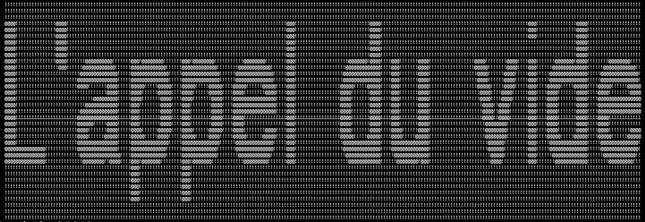
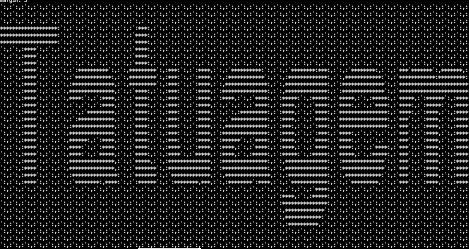

# Tatuagem, the boastful code signature suite

# Basic Example
```python3 tatuagem.py "tatuagem" ```

* defaults defined in tatuagem.py: '1' for text, '0' for background, unicode-arial.ttf for font 

# Elaborate Syntax Example
```python3 tatuagem.py "L'appel du vide" --font 'unicode-arial.ttf' --backsplash '!' --text '@'```




# Wallpaper: Pattern-Argument Syntax Example
```python3 tatuagem.py "Tatuagem" --pattern '`':,:'' ```

