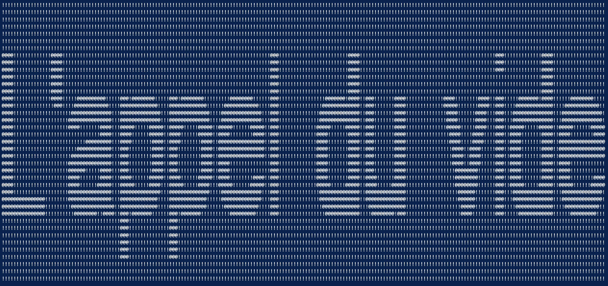

# Tatuagem, the boastful code signature suite

# Basic Syntax Example
```python3 tatuagem.py "L'appel du vide" --font 'unicode-arial.ttf' --backsplash '!' --text '@'```



# Regex-Argument Syntax Example
```python3 tatuagem.py "Tatuagem" --regex '`':,:'' ```


Features:
-[x] Regex-styled, regimented text backsplash
-[ ] Time stamping of signatures
-[x] Web3 compatible
-[x] 20+ coding languages supported

Default for font is unicode arial