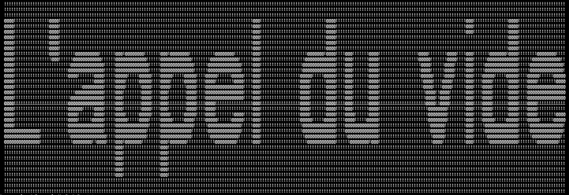
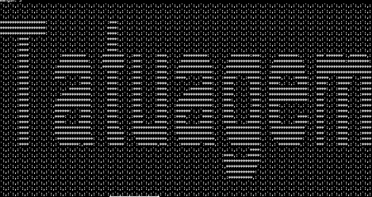

# Tatuagem - The Boastful Code Signature Suite


Generate ASCII art "tattoos" from text and apply them as comments to your source code!

## Installation

```bash
pip install Pillow numpy
```

## Quick Start

### Basic Example
```bash
python cli.py "tatuagem"
```

### Custom Text and Background Characters
```bash
python cli.py "Code" --text '@' --backsplash '!'
```



### Pattern Overlay Example
```bash
python cli.py "Tatuagem" --pattern '`':,:''
```



### Apply Tattoo to Your Project Files
```bash
python cli.py "MyProject" --recurse-path ./src/
```

This will add your ASCII art tattoo as a comment to all recognized source files in the directory.

## Options

```
  --text TEXT           Character for foreground/text (default: '1')
  --backsplash CHAR     Character for background (default: '0')
  --pattern PATTERN     Pattern string to overlay on background
  --margin N            Number of blank lines for top/bottom margin (default: 3)
  --font FONT          Font file to use (default: unicode-arial.ttf)
  --recurse-path PATH   Apply tattoo as comments to source files
```

## Project Structure

The codebase has been refactored for clarity and maintainability:

- **cli.py** - Main command-line interface (use this!)
- **core.py** - Core tattoo generation logic
- **font_manager.py** - Font template creation and management
- **file_operations.py** - Directory recursion and comment injection
- **params.py** - Global configuration constants
- **tatuagem.py** - Legacy entry point (deprecated, maintained for backward compatibility)

## Legacy Support

Old scripts using `tatuagem.py` will continue to work but will show a deprecation warning. Please migrate to using `cli.py` for new projects.

## Known Issues / TODO

- Prevent duplicate tattoos when running recursively multiple times
- Add shebang detection and preservation
- Add support for more languages in comment syntax detection 