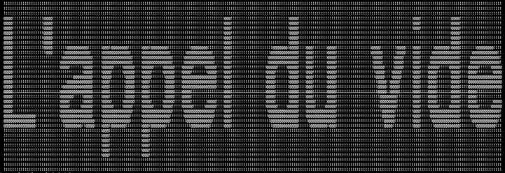
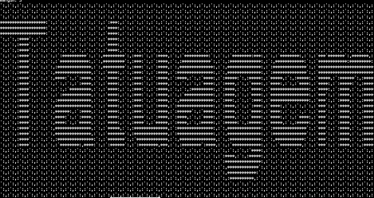

# Tatuagem, the boastful code signature suite
[](https://github.com/juleshenry/tatuagem/blob/badges/lang-coverage.json)
[](https://github.com/juleshenry/tatuagem/actions/workflows/badges.yml)

Tatuagem is a tool to generate ASCII art signatures (tattoos) and apply them to your code files recursively.

## Install

```bash
pip install tatuagem
```

## Usage

```bash
tatuagem [text_input] [options]
```

### Arguments

| Argument | Description | Default |
|----------|-------------|---------|
| `text_input` | The string you want to convert into a tattoo. Required if `--file` is not provided. | None |
| `--text` | The character used to draw the text pixels. | `1` |
| `--backsplash` | The character used to fill the background. | `0` |
| `--font` | A bundled font (`unicode-arial.ttf`, `Poppins-Medium.ttf`) or a path to any `.ttf`/`.otf` file. | `unicode-arial.ttf` |
| `--pattern` | A repeating string pattern to use for the background. Overrides `--backsplash`. | None |
| `--margin` | Number of empty lines (margin) to add above and below the text. | `3` |
| `--recurse-path` | Path to a directory. Tatuagem will walk through this directory and prepend the tattoo to every file found. | None |
| `--file`, `-f` | Path to a file containing text. <br>• **Standard Mode**: The content of the file is converted into the tattoo art.<br>• **Recurse Mode** (with `--recurse-path`): The content of the file is used *as-is* for the tattoo (useful for pre-generated art). | None |
| `--overwrite` | When using `--recurse-path`, this flag allows overwriting existing tattoos in files. Without this flag, files that are already tattooed will be skipped. | `False` |
| `--dry-run` | With `--recurse-path`: list the files that would be tattooed without writing anything. | `False` |
| `--check` | With `--recurse-path`: like `--dry-run`, but exit with status 1 if any file is missing its tattoo. Handy in CI. | `False` |
| `--verbose`, `-v` | Print the settings in use to stderr. | `False` |

## Examples

### Basic Example
Generate a simple tattoo.
```bash
tatuagem "tatuagem"
```
*Defaults: '1' for text, '0' for background, unicode-arial.ttf for font*

### Elaborate Syntax Example
Customizing the text and background characters.
```bash
tatuagem "L'appel du vide" --font 'unicode-arial.ttf' --backsplash '!' --text '@'
```



### Wallpaper: Pattern-Argument Syntax Example
Using a pattern string for the background.
```bash
tatuagem "Tatuagem" --pattern '`':,:''
```



### Recurse your project
Apply the generated tattoo to all files in `test_tattoo/`.
```bash
tatuagem "Tatuagem" --pattern '`':,:''  --recurse-path test_tattoo/
```

### Recurse your project with a text file
Apply the contents of `tests/aeaea.inc` as a header to all files in `test_tattoo/`.
```bash
tatuagem --file tests/aeaea.inc --recurse-path test_tattoo/
```

### Preview, or enforce in CI
```bash
tatuagem "Tatuagem" --recurse-path test_tattoo/ --dry-run   # show what would change
tatuagem --file test_input.txt --recurse-path . --check      # fail if anything is untattooed
```

### Replace existing tattoos with --overwrite
Update existing tattoos in files that were already tattooed. Without this flag, already-tattooed files will be skipped.
```bash
tatuagem "New Tattoo" --recurse-path test_tattoo/ --overwrite
```

## Features

✓ **Shebang detection and preservation** - files with `#!/...` shebangs keep them at the top

✓ **Safe for npm projects** - tattooed npm projects continue to work after tattooing

✓ **Idempotent** - Tattoos won't repeat on themselves if run multiple times

✓ **.tatignore support** - Exclude specific files and directories from tattooing

✓ **Any character, any font** - glyphs are rendered in memory, so accents, symbols and your own `.ttf` files all work

✓ **Skips hidden directories** - `.git`, `.venv` and friends are never touched

✓ **Hundreds of languages, safely** - block comments where the tattoo can't break out of them, line comments otherwise; files are skipped rather than corrupted. `<?php`, `<?xml ?>`, shebangs, encoding cookies and Dockerfile directives stay on top. Shared extensions (`.pl`, `.m`, `.pro`) are told apart by content, and extensionless scripts by their shebang

## .tatignore

Using the same matching rules as `.gitignore`, you can create a `.tatignore` file in the root of the directory you want to tattoo to specify patterns of files and directories to exclude from tattooing.

### .tatignore Syntax

The `.tatignore` file supports the following patterns:

- **Simple filenames**: `file.txt` - ignores any file named `file.txt`
- **Wildcards**: `*.log` - ignores all files ending with `.log`
- **Directory patterns**: `node_modules/` - ignores all files in `node_modules` directory
- **Recursive patterns**: `build/**` - ignores all files in `build` and its subdirectories
- **Comments**: Lines starting with `#` are treated as comments
- **Empty lines**: Empty lines are ignored

### .tatignore Example

```
# Ignore log files
*.log

# Ignore build artifacts
build/
dist/

# Ignore dependencies
node_modules/

# Ignore specific files
secrets.py
config.local.json

# Ignore test directories
tests/**
```

### Usage with .tatignore

1. Create a `.tatignore` file in the directory you want to tattoo (or copy `.tatignore.example` from this repository)
2. Add patterns for files/directories to exclude
3. Run tatuagem with `--recurse-path` as usual

```bash
# This will respect patterns in .tatignore
tatuagem "MyProject" --recurse-path ./my-project/
```

## Development

```bash
pip install -e ".[dev]"
pytest
ruff check .
```

### Coverage

- **Languages** — `python scripts/lang_coverage.py` tattoos every folder of the
  `tests/hello_worlds` corpus and counts the languages that get a comment valid in
  *that* language. Languages that can't hold a comment at all (Brainfuck, Piet, JSON…)
  are listed in the report but left out of the figure. CI fails if it drops below 90%.
- **Tests** — `pytest --cov`.

Both badges are computed by the [Coverage badges](.github/workflows/badges.yml)
workflow on every push to `main` and published to the `badges` branch.

This repo dogfoods itself: every source file carries a tattoo, and CI runs
`tatuagem --file test_input.txt --recurse-path . --check` to keep it that way.
New files can be tattooed with the same command minus `--check`.

Releases: `python publish.py 0.1.16` runs the tests and the dogfood check, bumps the version,
tags, and pushes; the tag triggers the PyPI publish workflow.
