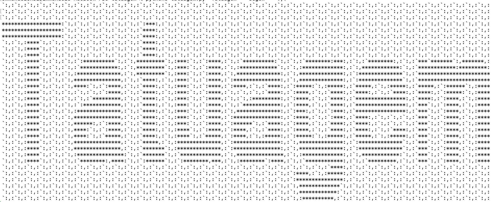

# Tatuagem, the boastful code signature suite

#Syntax Example
```python3 tatuagem.py "L'appel du vide" --font 'unicode-arial.ttf' --backsplash '!' --text '@'```



Features:
-[ ] Regex-styled, regimented text backsplash

-[ ] Time stamping of signatures

-[x] Web3 compatible
-[x] 20+ coding languages supported

Default for font is Poppins-Medium

Plan:
-[x] Target font to text center

-[x] Convert image to two-tone rgb map

-[x] Convert to text, regex style